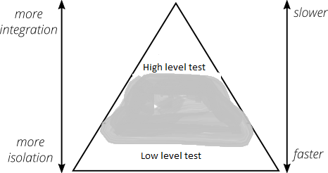
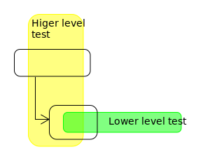
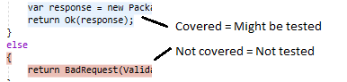
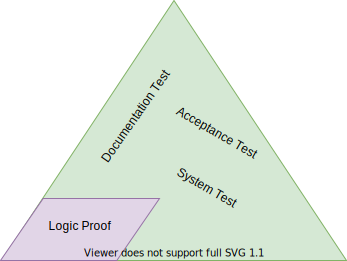
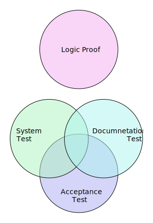

[logic_logo]: image/Logic_icon.png
[system_logo]: image/System_icon.png
[documentation_logo]: image/Documentation_icon.png
[acceptance_logo]: image/Acceptance_icon.png
[tdd_logo]: image/TDD_icon.png

>"A test is a way of demonstrating that something is
important. It shows you care." [Kevlin Henney]

# Theory

## Testing pyramid


Mike Cohn's original test pyramid consists of three layers that a test suite should consist of (bottom to top):

- Unit Tests
- Service Tests
- User Interface Tests

From a modern point of view the test pyramid seems overly simplistic and can therefore be misleading. Due to the test pyramid's simplicity the essence of the **test pyramid serves as a good rule of thumb** when it comes to establishing a test suite [[The Practical Test Pyramid](https://martinfowler.com/articles/practical-test-pyramid.html)]:

- Write tests with different granularity;
- The more high-level you get the fewer tests you should have.



## Write the tests you need

If a higher-level test gives you more confidence that your application works correctly, you should have it [[The Practical Test Pyramid](https://martinfowler.com/articles/practical-test-pyramid.html)].

Writing a unit test for a Controller class helps to test the logic within the Controller itself. This test won't tell you whether the controller's REST endpoint responds to HTTP requests. You move up the test pyramid and add a test that checks for exactly that - but nothing more [[The Practical Test Pyramid](https://martinfowler.com/articles/practical-test-pyramid.html)].

You don't test all the conditional logic and edge cases that your lower-level tests already cover in the higher-level test again. Make sure that the higher-level test focuses on the part that the lower-level tests couldn't cover [[The Practical Test Pyramid](https://martinfowler.com/articles/practical-test-pyramid.html)].



## How big is a unit

A unit test is a piece of code that invokes a unit of work and checks one specific end result of that unit of work. If the assumptions on the end result turn out to be wrong, the unit test has failed. A unit test's scope can span as little as a method or as much as multiple classes. [[The art of unit testing](https://livebook.manning.com/book/the-art-of-unit-testing-second-edition/chapter-1/24)]

## Code coverage

>"Test coverage is a useful tool for finding untested parts of a codebase. Test coverage is of little use as a numeric statement of how good your tests are." [Martin Fowler]

Test coverage should only be used to find untested code. Code coverage cannot show if code is tested but only that it is not tested. Just because code is executed by a test (code is reported as covered) does not mean it is checked by a test.



# Test Suite

Here are four common testing goals:

- I want to show the logic is correct.
- I want to show the system works.
- I want to show how to use this.
- I want to show this meets the acceptance criteria.

## Logic Proof

<font size="+2"><span style="color:green"> ![logic logo][logic_logo] **I want to show the logic is correct.**</span></font>

When trying to prove logic correct you should:

### Only execute the logic

Mock all other code. The mocks should contain as little code as possible. You don't want to tests Mock logic.

### Check all possible inputs

You should check the logic against all possible input values.

If the input space is to big to run tests on all possible inputs, random testing is sufficient when we tests smaller units of code.

> Partition testing (code path testing) is typically a bit better at uncovering failures; however, the difference is reversed by a modest increase in the number of points chosen for random testing. Roughly, by taking 20% more points in a random test, any advantage a partition test might have enjoyed is wiped out  [Richard Hamlet. "Random Testing". In: Encyclopedia of Software Engineering. Wiley, 1994, pp. 970–978.].

### Don't test to close to the code

You should use public entry points to execute logic. Do not break encapsulation to test a specific method. Tests should not break when you refactor your code.

## System Test

<font size="+2"><span style="color:green"> ![system logo][system_logo] **I want to show the system works.**</span></font>

The system test is intended to show that the parts of the software works together. Execute as little as possible to test the system.

You should have tests of different granularity laying on different places on the testing pyramid.

When you want to show that an API endpoint responds with the correct error when an invalid parameter is passed to it you don't need to instantiate a database (lower on the testing pyramid). When you want to show that the endpoint returns the correct value for a specific input value you probably want to instantiate the database and retrieve the value from the database (higher on the pyramid).

## Documentation Test

<font size="+2"><span style="color:green"> ![documentation logo][documentation_logo] **I want to show how to use this.**</span></font>

The test is intended to be executable documentation. This test should be accompanied by allot of comments explaining what the test is doing. It could help using Visual Studio&reg; extensions that allow for more elaborate comments, ([Rich Comments](https://docs.devexpress.com/CodeRushForRoslyn/120417/visualization-tools/rich-comments)).

This can be a way of keeping documentation aligned with the code.

Don't hide setup in methods for reusability. The purpose of these tests are not to create good code, but to explain what a user should do when using our code.

## Acceptance Test

<font size="+2"><span style="color:green"> ![acceptance logo][acceptance_logo] **I want to show this meets the acceptance criteria.**</span></font>

This test is meant to show that the user story is implemented. The test can be less general.
The tests can be associated with the story and used as regression.

## Building a Tests Suite

- Identify the risk areas and write more tests there.





### Logic proof test

There are two methods of generating input:

1. We can generate all possible inputs using xUnit Theory with MemberData:

```csharp

```

We generate the inputs:

```csharp

}
```

2. You can generate random inputs using FsCheck with xUnit.

```csharp

```

```csharp
// The critical part of using FsCheck is generating the random inputs

```

### System, Documentation & Acceptance Test

When creating a System, Documentation, and Acceptance tests readability is more impotent. We add a description/explanation, in a comment, as a preamble to the test

We reduce the amount of mock code in the tests by replacing it with read code as we build the codebase.

From ***V1*** to ***V2***:

***V1***: This is the first version and we don't yet have a database so we have to mock the ```PackageFileRepository``` and ```PackageRepositor```.

```csharp

}
```

***V2***: This is a later version and don't have to mock the dependencies. We do have to populate the database with test data.

```csharp
```

No change from ***V1*** to ***V2***:

Sometimes we don't have to update tests as we build out the codebase.
This test only check the validation code and never uses any dependencies.
We don't have to change this unit tests from ***V1*** to ***V2***.

```csharp

```

# Test Driven Design

<font size="+2"><span style="color:green"> ![tdd logo][tdd_logo] **I want help developing this.**</span></font>

Test Driven Development is a developer aide. It is intended to help the developer develop clean code that works. [Kent Beck. "Test Driven Development: By Example", 2002]()

When using Dest Driven Development we:[Kent Beck. "Test Driven Development: By Example", 2002]()

- only write new code when a test has failed;
- eliminate duplication.

These two rules imply the following: [Kent Beck. "Test Driven Development: By Example", 2002]()

- We must design organically, with running code providing feedback between decisions;
- We must write our own tests, because we can't wait 20 times per day for someone
else to write a test.
- Our development environment must provide rapid response to small changes.
- Our designs must consist of many highly cohesive, loosely coupled components, just
to make testing easy.

TDD cycle: [Kent Beck. "Test Driven Development: By Example", 2002]()

1. Write a test. Use the code as you imagine it will function.
2. Make it run. Implement the imagined functionality in a quick and simple manner.
3. Make it right. Now that the system is functioning correctly, Refactor the code. Remove duplication. Implement good code design.

Workflow: [Kent Beck. "Test Driven Development: By Example", 2002]()

1. Quickly add a test.
2. Run all tests and see the new one fail.
3. Make a little change.
4. Run all tests and see them all succeed.
5. Refactor to remove duplication.

# To read

- https://youtu.be/-nWhH-4wWBU?t=3379
- https://visualmutator.github.io/web/
