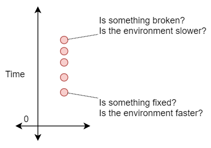
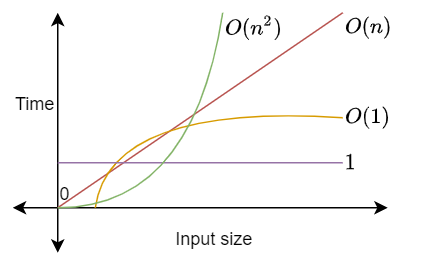
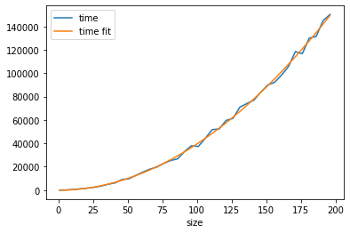
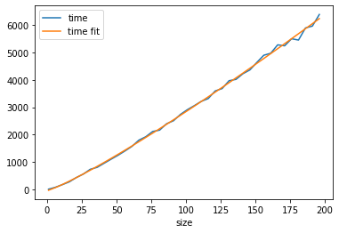

>I cannot profile my code's performance because I cannot get consistent timings.

It is not possible to tell if my code's performance has degraded because it is not possible to gather consistent timings. When using a cloud environment, I am sharing resources with many other processes. The thread my code runs in will be interrupted many times for varying durations. Performance timings do not mean much, because I cannot be sure if a change in timing is due to my code or the environment.



Big O allows me to decouple my performance metrics from individual timings. Big O describes how execution time change in relation to the size of the input. I am looking at the rate of change, therefore the variance in timings caused by the environment does not matter.



# How to do it

I want to compare Bubble Sort to Quick Sort.

- The first step is to generate input data. The input data should grow in one dimension. Make sure the inputs all follow one execution path.
- Then run the tests 3 times to average out variances in timings.
- Fit a curve to the timing data.

## Bubble Sort



Bubble sort fit expression: $time = -170 + 4.43 \cdot size^{1.976}$

## Quick Sort



Quick sort fit expression: $time = -41 + 14 \cdot size^{1.156}$

## Big O

From this we determine that Bubble Sort has $O(n^2)$ performance and Quick Sort has $O(n)$.

We can nou say that we would rather use Quick Sort than Bubble Sort.

# Code

## Generate data
This C# code will generate the data, get the timings and save them to a CSV file. 

Run `Test.RunTest()`.

```csharp
using System;
using System.Collections.Generic;
using System.Diagnostics;
using System.IO;
using System.Linq;
using System.Text;

namespace Perf
{
    public static class Sort
    {
        public static void BubbleSort(int[] data)
        {
            int i, j;
            int N = data.Length;

            for (j = N - 1; j > 0; j--)
            {
                for (i = 0; i < j; i++)
                {
                    if (data[i] > data[i + 1])
                    {
                        Exchange(data, i, i + 1);
                    }
                }
            }
        }

        public static void QuickSort(int[] data)
        {
            QuickSort(data, 0, data.Length - 1);
        }

        private static void Exchange(int[] data, int m, int n)
        {
            int temporary;

            // just for the proof of concept,
            // synthetically increase the algorithm execution time.
            System.Threading.Thread.Sleep(1);

            temporary = data[m];
            data[m] = data[n];
            data[n] = temporary;
        }

        private static void QuickSort(int[] data, int l, int r)
        {
            int i, j;
            int x;

            i = l;
            j = r;

            x = data[(l + r) / 2];
            while (true)
            {
                while (data[i] < x)
                    i++;
                while (x < data[j])
                    j--;
                if (i <= j)
                {
                    Exchange(data, i, j);
                    i++;
                    j--;
                }
                if (i > j)
                    break;
            }
            if (l < j)
                QuickSort(data, l, j);
            if (i < r)
                QuickSort(data, i, r);
        }
    }

    public static class Test
    {
        private static Random Random = new Random(5);

        public static void RunTest()
        {
            { // Bubble sort
                var results = new List<List<(int length, long time)>>();

                for (int c = 0; c < 3; c++)
                {
                    results.Add(
                        GetTimings(
                            GenerateData(200, 5),
                            (data) => Sort.BubbleSort(data)));
                }

                var csv = new StringBuilder();
                csv.AppendLine("size,run1,run2,run3");

                for (int cc = 0; cc < results[0].Count; cc++)
                {
                    csv.AppendLine($"{results[0][cc].length},{results[0][cc].time},{results[1][cc].time},{results[2][cc].time}");
                }

                var rr = csv.ToString();

                File.WriteAllText("Bubble.csv", csv.ToString());
            }

            { // Quick sort
                var results = new List<List<(int length, long time)>>();

                for (int c = 0; c < 3; c++)
                {
                    results.Add(
                        GetTimings(
                            GenerateData(200, 5),
                            (data) => Sort.QuickSort(data)));
                }

                var csv = new StringBuilder();
                csv.AppendLine("size,run1,run2,run3");

                for (int cc = 0; cc < results[0].Count; cc++)
                {
                    csv.AppendLine($"{results[0][cc].length},{results[0][cc].time},{results[1][cc].time},{results[2][cc].time}");
                }

                File.WriteAllText("QuickSort.csv", csv.ToString());
            }
        }

        private static List<int[]> GenerateData(int maxLength, int setpSize)
        {
            var inputs = new List<int[]>();

            for (int length = 1; length <= maxLength; length = length + setpSize)
            {
                inputs.Add(
                    Enumerable
                    .Range(1, length)
                    .Select(i => Random.Next(0, int.MaxValue))
                    .ToArray());
            }

            return inputs;
        }

        private static List<(int length, long time)> GetTimings(List<int[]> inputs, Action<int[]> action)
        {
            var result = new List<(int, long)>();

            foreach (var input in inputs)
            {
                var watch = new Stopwatch();
                watch.Start();
                action(input);
                watch.Stop();

                result.Add((input.Length, watch.ElapsedMilliseconds));
            }

            return result;
        }
    }
}
```

## Analyse data
This Python code will read the timing data from the CSV files and print the plots and the fit expression.

```python
import pandas as pd
import matplotlib.pyplot as plt
from scipy import optimize

bubble_raw = \
    pd \
    .read_csv("Bubble.csv");

bubble = \
    pd \
    .DataFrame( \
        { \
            "size": bubble_raw["size"], \
            "time": bubble_raw[["run1","run2","run3"]] \
                .apply(lambda row: row.values.sum()/row.count(), axis=1)}) \

quick_raw = \
    pd \
    .read_csv("QuickSort.csv");

quick = \
    pd.DataFrame({"size": quick_raw["size"], "time": quick_raw[["run1","run2","run3"]].apply(lambda row: row.values.sum()/row.count(), axis=1)})

def BigOExp(x, a, b, c):
    return a + b * pow(x, c);

bubble_params, bubble_params_covariance = optimize.curve_fit(BigOExp, bubble["size"], bubble["time"])
quick_params, quick_params_covariance = optimize.curve_fit(BigOExp, quick["size"], quick["time"])

bubble["time fit"] = bubble["size"].map(lambda size: BigOExp(size, bubble_params[0], bubble_params[1], bubble_params[2]))
bubble.plot("size", ["time", "time fit"])
print(f"{bubble_params[0]} + {bubble_params[1]}(szie)^{bubble_params[2]}")

quick["time fit"] = quick["size"].map(lambda size: BigOExp(size, quick_params[0], quick_params[1], quick_params[2]))
quick.plot("size", ["time", "time fit"])
print(f"{quick_params[0]} + {quick_params[1]}(szie)^{quick_params[2]}")
```