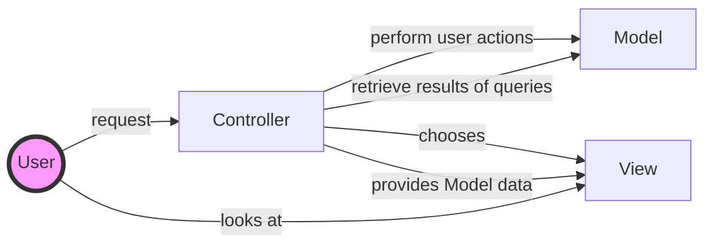
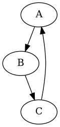

# ASP.NET Core MVC






```puml

class BaseEntity
interface ISoftDeletedEntity
interface ISlugSupported
interface IStoreMappingSupported
interface ISettings

package "Affiliate Collections" {
    class Affiliate extends BaseEntity
    class Affiliate implements ISoftDeletedEntity
}

package "Blogs Collections" {
    class BlogComment extends BaseEntity
    class BlogPostTag
    class BlogSettings implements ISettings
    class BlogPost extends BaseEntity
    class BlogPost implements ISlugSupported
    class BlogPost implements IStoreMappingSupported
    class BlogCommentApprovedEvent
}
```
