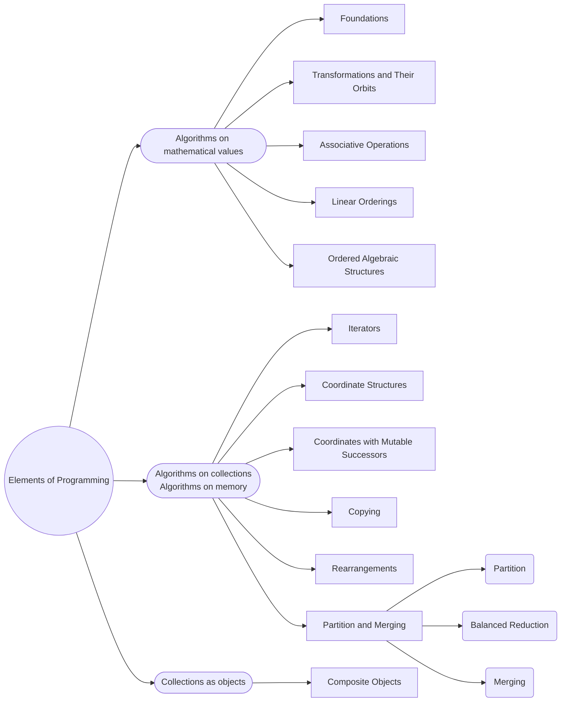

# Elements of Programming

## Categories of ideas

|  | Abstract | Concrete |
|--|--|--|
| Entity | An individual thing that is eternal and unchangeable | An individual thing that comes into and out of existence in space and time |