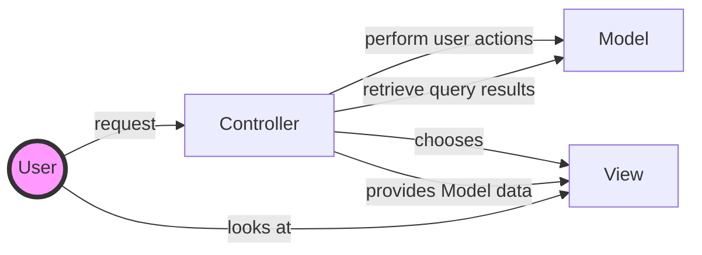

[TOC]

# Type theory

- **Type**($\tau$), **term**($e$), value
  - term is of type: $e:\tau$.
  - types are a collection (not necessarily sets) of the values that the term might evaluate to.
- **Typing environment**($\Gamma$), **type assignment**, **type judgement**
  - Typing takes place in an environment.
  - A typing environment represents the association between variable names and data types.
  - An environment $\Gamma$ is a set or ordered list of pairs $\langle x,\tau \rangle$, written as $x:\tau$, where $x$ is a variable and $\tau$ is a type.
  - $\langle x,\tau \rangle$ is an assignment.
  - The judgement $\Gamma \vdash e:\tau$ is read as "$e$ has type $\tau$ in context $\Gamma$".
- **Rewriting rules**, **conversion**, **reduction**
  - Conversion rules or, if the rule only works in one direction, a reduction rule.
    - $2+2\twoheadrightarrow 4$: $2+2$ and $4$ are syntactically different terms, but $2+2$ reduces to $4$.
  - $2+2 \equiv 4$: These rules also establish equivalences.
- **Type checking**
  - $\Gamma \vdash e:\tau ?$
    - can the term $e$ be assigned the type $\tau$ in the type environment $\Gamma$?
- **Typability**
  - $\exists \Gamma ,\tau .\Gamma \vdash e:\tau ?$
    - Given a term $e$, does there exists a type environment $\Gamma$ and a type $\tau$ such that the term $e$ can be assigned the type $\tau$ in the type environment $\Gamma$.
- **Type inhabitation**
  - $\displaystyle \exists e.\Gamma \vdash e:\tau ?$
    - Given a type environment $\Gamma$ and a type $\tau$, does there exists a term $e$ that can be assigned the type $\tau$ in the type environment $\Gamma$?

# ASP.NET Core MVC

## Model View Controller

# Object Orientated Design

## SOLID

- **S**ingle-responsibility
  - a class should only have a single responsibility.
  - only changes to one part of the software's specification should be able to affect the specification of the class.
- **O**pen–closed principle
  - software entities should be open for extension, but closed for modification.
- **L**iskov substitution principle
  - objects in a program should be replaceable with instances of their subtypes without altering the correctness of that program.
  - design by contract.
- **I**nterface segregation principle
  - many client-specific interfaces are better than one general-purpose interface.
- **D**ependency inversion principle
  - depend upon abstractions, not concretions.

### Liskov substitution principle

Let $\phi (x)$ be a property provable of objects $x$ of type $T$.
Then $\phi (y)$ should be true $\forall y$ of type $S : S$ is a subtype of $T$

## OO

- [whats-the-relation-between-oop-and-category-theory](https://cstheory.stackexchange.com/questions/21387/whats-the-relation-between-oop-and-category-theory)
- [Elements of Programming](http://elementsofprogramming.com/book.html)
- [Objects and classes, coalgebraically](http://citeseerx.ist.psu.edu/viewdoc/download;jsessionid=466BD1639255F6FD6BD151A873A5AE1D?doi=10.1.1.29.6018&rep=rep1&type=pdf)